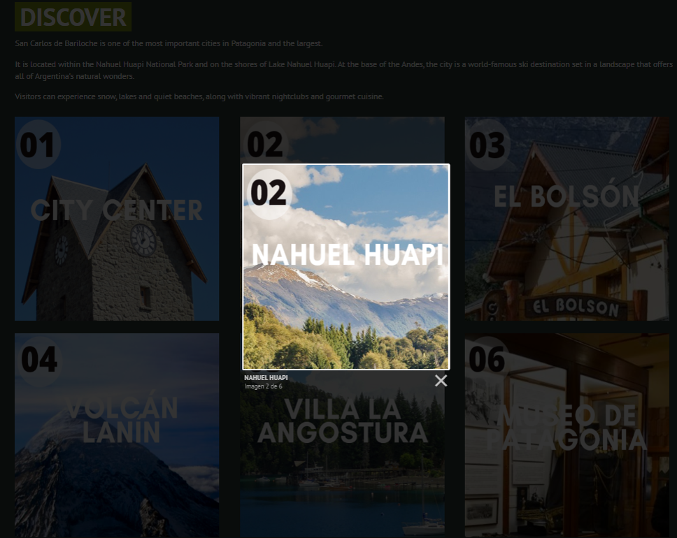
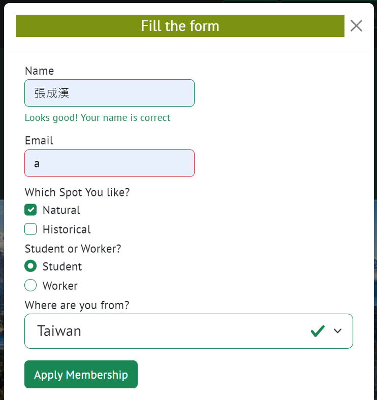

# Project Name: Bariloche Tourism Website

Welcome to the Bariloche Tourism Website! This project showcases a travel agent website focused on promoting Bariloche, a beautiful tourism destination in Argentina. The website provides visitors with stunning photographs of Bariloche and an informative video of the picturesque lake. The project was developed using HTML, CSS, JavaScript, and Bootstrap, incorporating various features to enhance the user interface and user experience.

## Features

1. **Lightbox Photo Gallery:** The website includes a visually appealing photo gallery that utilizes the lightbox feature. Visitors can click on the images to view them in a larger format, enhancing their browsing experience and showcasing the beauty of Bariloche.

<div align=center></div>


2. **Contact Information:** Essential contact information is provided on the website in a structured and visually appealing manner. A Bootstrap list is used to display contact details, making it easy for visitors to access information such as phone numbers, email addresses, and IG.


3. **Membership Application Form:** Recognizing the potential interest of visitors in becoming members, a membership application form is provided. Visitors can enter their name and email address and other information to apply for membership. The form includes validation to ensure that correct information is entered. If the name or email address is improperly formatted, an error message is displayed.



4. **Responsive Web Design (RWD):** The website is designed to be responsive using Bootstrap. This ensures that visitors can easily access and navigate the website from various devices, including desktop computers, tablets, and mobile phones, without compromising the user experience.

.png)

## Installation

To set up the project locally, follow these steps:

1. Clone the repository:

```bash
git clone https://github.com/your-username/bariloche-tourism-website.git
```

2. Open the project folder:

```bash
cd bariloche-tourism-website
```

3. Open the `index.html` file in your preferred web browser.

## Usage

Once the website is open in your web browser, you can explore the following sections:

- Browse through the stunning photographs of Bariloche by clicking on the images displayed in the photo gallery. The lightbox feature allows you to view the images in a larger format.

- Find the contact information for the travel agent by referring to the contact details listed in the Bootstrap list. You can locate the phone numbers, email addresses, and office locations to get in touch with the travel agent.

- If you are interested in becoming a member, fill out the membership application form. Enter your name and email address in the provided fields and click the submit button. If any errors occur due to improper formatting, error messages will be displayed, prompting you to correct the information.

- The website's responsive design ensures a seamless browsing experience across different devices. Feel free to access the website using various devices such as desktop computers, tablets, or mobile phones.

## Contributing

Contributions to this project are welcome. If you have any suggestions, improvements, or bug fixes, please submit a pull request. 

Before submitting a pull request, please ensure that your changes are well-documented and tested.

## License

This project is licensed under the [MIT License](LICENSE). You are free to use, modify, and distribute this project for personal or commercial purposes.

## Acknowledgements

We would like to express our gratitude to the following resources for their valuable contributions to this project:

- Bootstrap (https://getbootstrap.com/): Used for its responsive design, styling components, and form validation.

- Lightbox (https://lokeshdhakar.com/projects/lightbox2/): Implemented for the photo gallery feature.

- Unsplash (https://unsplash.com/): Provided the beautiful photographs of Bariloche.

## Contact

If you have any questions or feedback regarding this project
